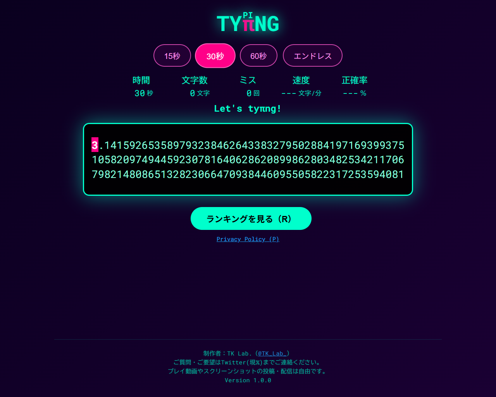

# 「TYπNG」

円周率を打つだけのタイピングゲームです。

推奨環境: Windows + Google Chrome

---

### スクリーンショット

### プレイ方法
→ [ここをクリックしてプレイ](https://tk-laboratory.github.io/TY-PI-NG/)
（GitHub Pagesで公開中。）

### 主な機能
- **制限時間モード**  
  - 制限時間内に何文字打てるか挑戦するモードです。15、30、60秒モードがあります。
- **エンドレスモード**  
  - 制限時間がなく、好きなだけ打つことができるモードです。
  
### 操作
- 文字を入力してスタート
- Esc で中断（制限時間モードのみ）、もう一度
- Ctrl + Enter で終了（エンドレスモードのみ）

### 作者
TK Lab. [@TK_Lab_](https://x.com/TK_Lab_)

### 更新履歴 (Changelog)
- **v1.0.0** (2026-06-08)
  - 初版公開
- **v1.0.1** (2026-06-08)
  - ランキング登録、表示のバグを修正
- **v1.0.2** (2026-06-10)
  - プレイ終了時に時間表示が1秒のままになることがあるバグを修正
- **v1.0.3** (2026-06-11)
  - ランキング表示画面のレイアウトを改善
- **v1.0.4** (2026-06-11)
  - ランキング表示画面が横に見切れている際に横スクロールバーを表示
- **v1.0.5** (2026-06-11)
  - エンドレスモード終了時のバグを修正
- **v1.0.6** (2026-06-11)
  - エンドレスモード終了時の表示を修正
- **v1.0.7** (2026-06-12)
  - プレイ終了時にカーソル位置の文字をミスしているとカーソルが消えるバグを修正
- **v1.1.0** (2026-06-13)
  - プレイ終了後、マウスオーバーで1文字ごとの入力時間を表示する機能を追加

プレイ動画やスクリーンショットの投稿・配信は自由です。

ご質問・ご要望はTwitter（現𝕏）のDMやリプライまでご連絡ください。
